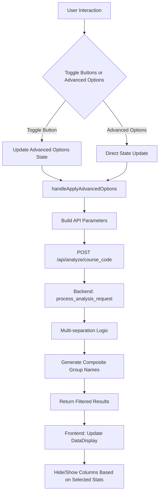

# Advanced Options Fix Implementation Plan

## Problem Analysis

The current advanced options functionality has several critical issues:

1. **No Backend Integration**: The `handleApplyAdvancedOptions` function only logs to console and doesn't make API calls
2. **Statistics Name Mismatch**: Frontend uses lowercase with underscores, but display shows proper title case
3. **Missing Column Filtering**: DataDisplay always shows all columns regardless of selected statistics
4. **Incomplete Season Filtering**: Season checkboxes are not implemented
5. **Single Separation Only**: Current system only supports one separation method at a time

## Technical Architecture

### Data Flow



### Key Design Decisions

1. **Statistics Management**: Centralized mapping between frontend display names and backend keys
2. **Multi-Separation**: Support multiple separation criteria with composite group names like "Alice, 2023, Fall"
3. **Dynamic Columns**: Hide/show table columns based on selected statistics (completely hidden when unchecked)
4. **Button Integration**: Existing toggles update advanced options state seamlessly
5. **Extensibility**: Generic system to easily add new statistics later

## Implementation Details

### Frontend Changes

#### 1. Statistics Mapping Utility (`frontend/src/utils/statsMapping.js`)
```javascript
export const STAT_MAPPINGS = {
  'overall_quality': 'Overall Quality',
  'instructor_effectiveness': 'Instructor Effectiveness', 
  'intellectual_challenge': 'Intellectual Challenge',
  'workload': 'Workload'
  // Easy to extend for new statistics
};

export const getBackendKey = (displayName) => {
  return Object.keys(STAT_MAPPINGS).find(key => STAT_MAPPINGS[key] === displayName);
};

export const getDisplayName = (backendKey) => {
  return STAT_MAPPINGS[backendKey] || backendKey;
};
```

#### 2. AdvancedOptions Component Updates
- Change statistics labels to use proper title case from mapping
- Replace single separation dropdown with multi-select checkboxes for "Separate By"
- Add season filtering checkboxes (Fall, Spring, Summer, Intersession)
  - just keep this as FA, SP, SU, IN. This will also make it easier, because you will need to pull these out of the relevant_periods in the metadata.
- Update state structure to handle arrays for separation keys

#### 3. App.js Integration
- Modify existing toggle buttons to update advanced options state:
  - "Show Last 3 Years" → Set `min_year` in filters
  - "Separate by Teacher" → Add/remove 'instructor' from separation array
- Implement proper API calls in `handleApplyAdvancedOptions`
- Pass selected statistics to DataDisplay component

#### 4. DataDisplay Component Updates
- Accept `selectedStats` prop to determine which columns to show
- Dynamically generate headers array based on selected statistics
- Filter table data to only include selected statistic columns
- Handle composite group names for multi-separation display

### Backend Changes

#### 1. Analysis.py Updates
- Modify `separate_instances` function to accept multiple separation keys
- Implement composite group name generation:
  ```python
  def generate_composite_group_name(instance, separation_keys, instance_key):
      name_parts = []
      for key in separation_keys:
          if key == 'instructor':
              name_parts.append(instance.get('instructor_name', 'Unknown'))
          elif key == 'year':
              name_parts.append(str(get_instance_year(instance_key)))